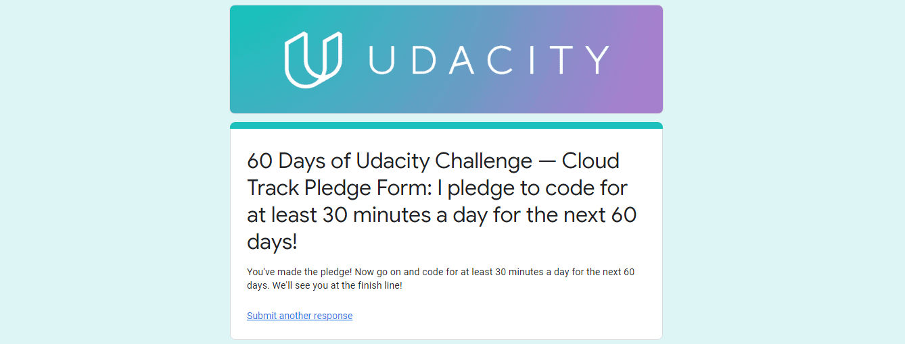
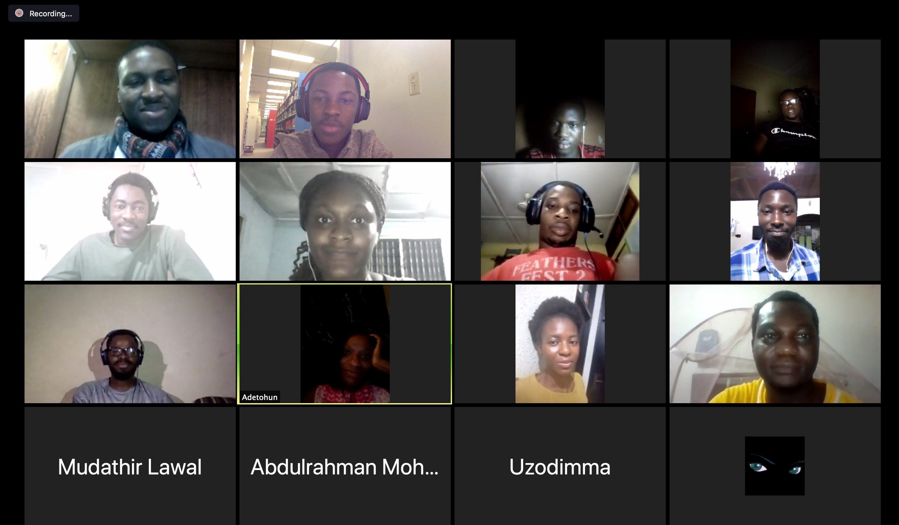

# 60 Days of Udacity Challenge
 I would be logging daily updates of my progess during the [Bertelsmann #60DaysofUdacity](https://sites.google.com/udacity.com/bertelsmann-challenge/community/60-days-of-udacity) coding challenge. The goal of the challenge is to help me set *Specific, Measurable, Achievable, Realistic, Time-Bound (SMART)* goals for the next two months. The two elements for success in this challenge are *consistency* and *commitment*. I'm excited taking up this challenge!
 

___
 ## D1 (12-09-19)
- Signed the Bertelsmann #60DaysofUdacity Pledge form
- Completed lesson 12 and started lesson 13 of the Cloud Challenge

I encourage @2nji and @abdulloooh to share their progress for the day!
___
 ## D2 (12-10-19)
- Completed lesson 13 of the Cloud Challenge

I encourage @Abisola and @Adeleye Adewale to share their progress for the day!
___
 ## D3 (12-11-19)
- Started lesson 14 of the Cloud Challenge, and completed first two labs in the lesson

I encourage @Ademola Kunmi and @Adenle Abiodun to share their progress for the day!
___
 ## D4 (12-12-19)
- Completed lesson 14 of the Cloud Challenge
- Stumbled on error deleting S3 buckets created by Elastic Beanstalk but found a solution was to delete the bucket policy first

I encourage @Adeoye Adela and @Adetoun to share their progress for the day!
___
 ## D5 (12-13-19)
- Completed lesson 15 of the Cloud Challenge
- Got into the Intel Edge AI Scholarship Challenge
- Watched first video in the Intel course

I encourage @Adewale Olaore and @Aisha to share their progress for the day!
___
 ## D6 (12-14-19)
- Completed lesson 16 of the Cloud Challenge
- Watched the second video in the Intel course

I encourage @AKINOLA Victor and @Alexander Garuba to share their progress for the day!
___
 ## D7 (12-15-19)
- Completed lesson 17 of the Cloud Challenge
- Watched the third video in the Intel course

I encourage @A3AJAGBE and @anu to share their progress for the day!
___
## Missed Day (12-16-19)
___
 ## D8 (12-17-19)
- Started Part 3 of the Cloud Challenge, and watched 73% of Lesson 18
- Watched the fourth video in the Intel course

I encourage @Ayobami Fatanmi and @Babatunde Olusola to share their progress for the day!
___
 ## D9 (12-18-19)
- Completed remaining lessons and labs in Lesson 18, started lesson 19 of the Cloud Challenge
- Watched the fifth video in the Intel course

I encourage @Bakare Peace and @Benita Ojugo Ekene-Okikere to share their progress for the day!
___
 ## D10 (12-19-19)
- Completed 74% of lesson 19 in the Cloud Challenge
- Read the recommended article explaining the CI/CD process

I encourage @Bolaji Adetoye and @Bonat to share their progress for the day!
___
 ## D11 (12-20-19)
- Completed lesson 19 in the Cloud Challenge
- Completed lesson 1 in the Intel course

I encourage @Chiazokam Echeta and @Chidinma Godwin to share their progress for the day!
___
 ## D12 (12-21-19)
- Reviewed lesson 1 in the Intel course
- Started lesson 2 and completed until 37% until I got stuck at the exercise

I encourage @Chimezie.Ogbuu and @Chukwuemekanweke to share their progress for the day!
___
 ## D13 (12-22-19)
- Continued lesson 2 of the Intel course, watched a couple of videos and completed two exercises involving downloading pretrained OpenVINO models and pre-processing inputs

I encourage @Cloud_ML_Engineer and @Codedkate to share their progress for the day!
___
 ## D14 (12-23-19)
- Completed final exercise in lesson 2 of the Intel course involving deploying an app on the edge, thus finished the lesson
- Started lesson 3 on Model Optimizer

I encourage @Dammycloud and @David to share their progress for the day!
___
 ## D15 (12-24-19)
- Continued lesson 3 in the Intel Course on Model Optimizer and covered 40% in the lesson including the exercise on converting a TensorFlow Model into an Intermediate Representation for the OpenVINO Inference Engine using the Model Optimizer

I encourage @David C and @Delaney to share their progress for the day!
___
 ## D16 (12-25-19)
- Completed lesson 3 in the Intel Course except for the exercise on "Custom layers" where I could not set things up correctly
- Began review of lesson 19 in the Cloud Challenge

I encourage @Dimeji and @Don Ebi to share their progress for the day!
___
 ## D17 (12-26-19)
 - Completed final exercise in lesson 3 of the Intel Course
- Started and Completed lesson 4 in the Intel Course except for the exercise on "Integrate into an App" where I could not complete the code

I encourage @Ebere Uzodufa and @Eje Joshua to share their progress for the day!
___
 ## D18 (12-27-19)
 - Completed final exercise in lesson 4 of the Intel Course
- Started lesson 5 in the Intel Course; watched a couple of videos and completed first two exercises involving handling input streams and processing model outputs

I encourage @Elvis and @Emeka Richard to share their progress for the day!
___
 ## D19 (12-28-19)
 - Completed final exercise and remaining lessons in the Intel Challenge Course

I encourage @emmanuel ajaero and @Emmanuel Chukwu to share their progress for the day!
___
 ## D20 (12-29-19)
 - Continued review of lesson 19 in the Cloud Challenge
 - Read the official guide to install OpenVINO on my local machine (https://docs.openvinotoolkit.org/latest/_docs_install_guides_installing_openvino_linux.html)

I encourage @Eniwoke Cornelius and @Ezekiel Oladejo to share their progress for the day!
___
 ## D21 (12-30-19)
 - Continued review of lesson 19 in the Cloud Challenge
 - Started Udacity's "C++ for Programmers" course and completed Lesson 1

I encourage @Fatima Sheikh and @Gabicle to share their progress for the day!
___
 ## D22 (12-31-19)
 - Returned to my CV Nanodegree and began reviewing the Lesson on RNN's
 - Continued the "C++ for Programmers" course and completed Lessons 2 and 3

I encourage @Gideon and @GMike to share their progress for the day!
___
 ## D23 (01-01-20)
 - Completed _init_ and _forward_ methods for DecoderRNN model in CVND
 - Completed Notebook 1 in _Image Captioning_ Project in CVND

I encourage @Habeeb Olakunle and @han4xt to share their progress for the day!
___
 ## D24 (01-02-20)
 - Completed notebook 2 on _Training CNN-RNN model_ in CVND Project 2
 - Completed Lessons 1-3 in Module 4 _Object Tracking and Localization_ in CVND

I encourage @Idrees and @Ifeanyi madu to share their progress for the day!
___
 ## D25 (01-03-20)
 - Completed CNN-RNN encoder-decoder model in CVND Project 2
 - Completed notebook 3 on _Inference_ and submitted CVND Project 2
 - Completed Lesson 4 and 50% of Lesson 5 in Module 4 _Object Tracking and Localization_ in CVND

I encourage @Ifeoluwa Sobogun and @Ifeoma Udoye to share their progress for the day!
___
 ## D26 (01-04-20)
 - Completed Lessons 5-7 in Module 4 _Object Tracking and Localization_ in CVND
 - Completed notebook 1 and 2 in CVND Project 3

I encourage @Ihu and @Ilori Temitayo to share their progress for the day!
___
 ## D27 (01-05-20)
 - Completed final notebook and submitted CVND Project 3

I encourage @innociousBliss and @itssadon to share their progress for the day!
___
 ## D28 (01-06-20)
 - Resumed the "C++ for Programmers" course, completed  Lesson 4 - _Control Flow_

I encourage @Jephthah and @John Key to share their progress for the day!
___
 ## D29 (01-07-20)
 - Completed Lessons 5-7 in the "C++ for Programmers" course

I encourage @Kazeem Tijani and @Kehinde Faleye to share their progress for the day!
___
 ## D30 (01-08-20)
 - Completed 50% of Lesson 8 on _Classes_ in the "C++ for Programmers" course.

I encourage @Kenny Salaam and @kolade afeez to share their progress for the day!
___
 ## D31 (01-09-20)
 - Completed Lesson 8 on _Classes_ in the "C++ for Programmers" course and started Lesson 9 on _Overloading_

I encourage @Lateef_og and @Michael Mekuleyi to share their progress for the day!
___
 ## D32 (01-10-20)
 - Completed Lesson 9 on _Overloading_ and Lesson 10 on _Templates_ in the "C++ for Programmers" course.

I encourage @Mike Ajala and @Mudathir to share their progress for the day!
___
 ## D33 (01-11-20)
 - Completed Lesson 11 on _Classes and Inheritance_ and Lesson 12 on _PolyMorphism_ in the "C++ for Programmers" course.

I encourage @Mudathir and @Musharaf to share their progress for the day!
___
 ## D34 (01-12-20)
 - Completed remaining lessons in the "C++ for Programmers" course including Lesson 13 on _Vectors and Iterators_, Lesson 14 on _Interview Questions_ and Lesson 15 on _C++ Checkpoint_. Done! 

I encourage @Nwobodo Leonard and @Obeta Ifeanyichukwu Malachy to share their progress for the day!
___
 ## D35 (01-13-20)
 - Completed 45% of Lesson 6 on _Convolutional Neural Networks_ in the "Intro to Deep Learning with PyTorch from Facebook" course.
 - Trained a MLP to classify the MNIST dataset and got good results

I encourage @Okerentie Ortisemisan David and @Oladapo Daniel to share their progress for the day!
___
 ## D36 (01-14-20)
 - Completed 70% of Lesson 6 on _Convolutional Neural Networks_ in the "Intro to Deep Learning with PyTorch from Facebook" course.

I encourage @Oladiran Segun Solomon and @Olatunde Babawale to share their progress for the day!
___
 ## D37 (01-15-20)
 - Completed 86% of Lesson 6 on _Convolutional Neural Networks_ in the "Intro to Deep Learning with PyTorch from Facebook" course.

I encourage @Olatunde Paul and @Olawale Otubu to share their progress for the day!
___
 ## D38 (01-16-20)
 - Completed Lesson 6 on _Convolutional Neural Networks_ in the "Intro to Deep Learning with PyTorch from Facebook" course.

I encourage @Olayiwola and @Olubukola Adeboye to share their progress for the day!
___
 ## D39 (01-17-20)
 - Completed Lesson 7 on _Style Transfer_ in the "Intro to Deep Learning with PyTorch from Facebook" course.

I encourage @Olufisayo and @Oluwaleke Tade to share their progress for the day!
___
 ## D40 (01-18-20)
 - Completed Lesson 8 on _Recurrent Neural Networks_ in the "Intro to Deep Learning with PyTorch from Facebook" course.
 - Attended #sg_nigeria meetup with @Kazeem Tijani @Adetoun @Benita Ojugo Ekene-Okikere @Bolaji Adetoye @Onyedikachi Okwa @vahiwe @Mudathir Lawal @Uzodimma @vahiwe @Moses @Demilade @Codedkate @Mr. B.E @'Dotun Aremu @Ifeoma Udoye @John Adedigba @Tomi Arotiba

I encourage @Oluwaseun and @Oluwaseyi Falodun to share their progress for the day!
___
 ## D41 (01-19-20)
 - Started Lesson 9 (and completed 23%) of _Sentiment Prediction and RNNs_ in the "Intro to Deep Learning with PyTorch from Facebook" course.

I encourage @Oluwole and @Onyedikachi Okwa to share their progress for the day!
___
 ## D42 (01-20-20)
 - Completed Lesson 9 on _Sentiment Prediction and RNNs_ and Lesson 10 on _Deploying PyTorch models_ thus finishing 100% of the "Intro to Deep Learning with PyTorch from Facebook" course.
 - It's Day 42 (42/60 = 70%). I never knew I would be able to stay this consistent. Thanks to such energetic community here.

I encourage @Opeyemi Olabode and @Paul to share their progress for the day!
___
 ## D43 (01-21-20)
 - Returned to lesson 19 in the Cloud Challenge on _Getting Started with CloudFormation_ and created my VPC from terminal and also SSH'ed into my EC2 instance using the AWS CLI tool.
 - Started lesson 20 on "Infrastructure Diagrams" and completed 36% of the contents.
 - Organized daily quiz in the #sg_nigeria channel, and it was interesting, to say the least.

I encourage @Peterproxy and @Raphael Etim to share their progress for the day!
___
 ## D44 (01-22-20)
 - Completed 64% of lesson 20 on "Infrastructure Diagrams".
 - Particpated in daily quiz in the #sg_nigeria channel. It was very interesting, tricky enough to show me I need to revise the GIT concepts learned earlier.

I encourage @RasheedK and @Russell Nyorere to share their progress for the day!
___
 ## D45 (01-23-20)
 - Completed 82% of lesson 20 on "Infrastructure Diagrams".
 - Particpated in daily quiz in the #sg_nigeria channel. It was very interesting, tricky enough to show me I need to revise the LINUX SHELL concepts learned earlier.

I encourage @Sadiq and @sekinah to share their progress for the day!
___
 ## D46 (01-24-20)
 - Completed lesson 20 on "Infrastructure Diagrams".
 - Particpated in daily quiz in the #sg_nigeria channel. It was very interesting, tricky enough to show me I need to revise the GIT concepts learned earlier.

I encourage @show and @Sir_LIGHTON to share their progress for the day!
___