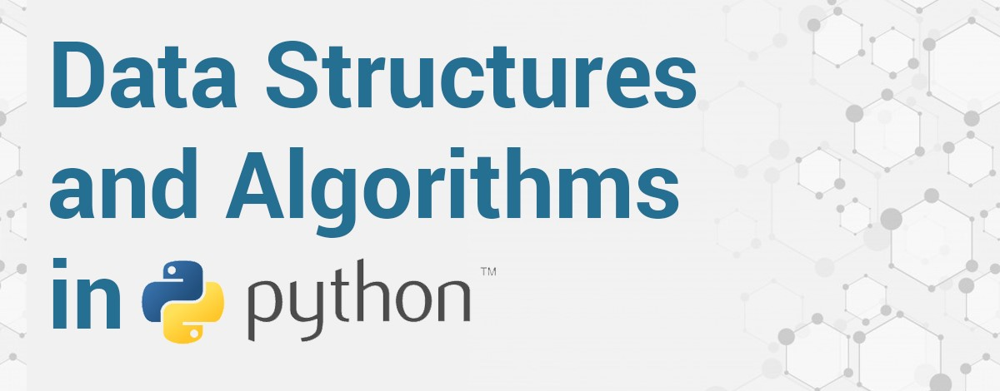

# Data Structures and Algorithms Challenge
 I would be logging daily updates of my progess during the DSA learning challenge. The goal of the challenge is to help me set *Specific, Measurable, Achievable, Realistic, Time-Bound (SMART)* goals for the next two months. The two elements for success in this challenge are *consistency* and *commitment*. I'm excited taking up this challenge!
 

I would learning by using the following methods:

1. Text: Each day, I would complete at least 10 pages in the book [Data Structures and Algorithms in Python by Michael T Goodrich, Roberto Tamassia, Michael H Goldwasser](https://www.amazon.com/Structures-Algorithms-Python-Michael-Goodrich/dp/1118290275).
2. Lecture: I will audit the [CS 401 Computer Algorithms course](https://sidiropo.people.uic.edu/courses/2020_spring_401/) in my school this term. The official text for this course is [Algorithm Design by Jon Kleinberg and Éva Tardos](https://www.pearson.com/us/higher-education/program/Kleinberg-Algorithm-Design/PGM319216.html).
3. YouTube: I will follow through the lectures and revision videos in the popular [MIT 6.006 Introduction to Algorithms, Fall 2011 course](https://www.youtube.com/playlist?list=PLUl4u3cNGP61Oq3tWYp6V_F-5jb5L2iHb).
4. Practice: I would do my best to solve as many competitive programming problems I can find to practice the DSA concepts I'll be learning in this challenge. I would majorly practice on [Leetcode](https://leetcode.com/).
___
 ## D1 (01-13-20)
- Read through pages 1-50 of the text. Such rigorous review of programming concepts in Python

 ## D2 (01-14-20)
- Completed Reinforcement Problems R-1.1 to 1.12, Creativity Problems C-1.13 to 1.28

 ## D3 (01-15-20)
- Completed Project Problems P-1.29 to 1.36, Starting Chapter 2 - _Object-Oriented Programming_ tomorrow

 ## D4 (01-16-20)
- Completed reading Chapter 2 - _Object-Oriented Programming_ and Reinforcement Problems R-2.1 to 2.4

 ## D5 (01-17-20)
- Completed Reinforcement Problems R-2.5 to 2.23 of Chapter 2

 ## D6 (01-18-20)
- Participated in #StudyJam 1

 ## D7 (01-19-20)
- Completed Creativity Problems C-2.24 to 2.32 of Chapter 2

 ## D8 (01-20-20)
- Completed Project Problems C-2.33 to 2.35 of Chapter 2

 ## D9 (01-21-20)
- Started Project Problem C-2.35 of Chapter 2. Built the required classes and major methods. Left with setting up methods for colliding animals and dying fishes. This should be completed tomorrow.

 ## D10 (01-22-20)
- Completed Project Problems P-2.35 to 2.39, Starting Chapter 3 - _Algorithm Analysis_ later today

 ## D11 (01-23-20)
- Started Chapter 3, Read through pages 109-121 of the text.

 ## D12 (01-24-20)
- Read through pages 121-136 of Chapter 3

 ## D13 (01-25-20)
- Completed remaining pages in Chapter 3. Completed Reinforcement Problems R-3.1 to 3.8

 ## D14 (01-26-20)
- Participated in #StudyJam 2