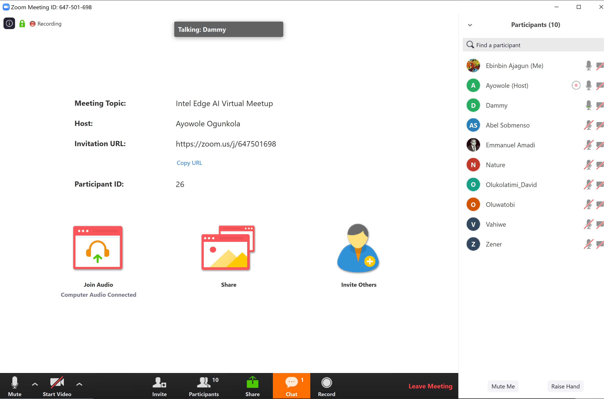

# 30 Days of Udacity Challenge
 I would be logging daily updates of my progess during the [Intel Edge AI #30DaysofUdacity](https://sites.google.com/udacity.com/intel-edge-ai-scholarship/community/30-days-of-udacity) coding challenge. The goal of the challenge is to help me set *Specific, Measurable, Achievable, Realistic, Time-Bound (SMART)* goals for the next two months. The two elements for success in this challenge are *consistency* and *commitment*. I'm excited taking up this challenge!
 

___
 ## D1 (01-25-20)
 - Returned to the Classroom and reviewed contents in Lesson 3. 
 - Facilitated the weekly webinar in the #sg_nigeria channel. It was exciting reviewing concepts on Model Optimizer, Intermediate Representation and Custom layers. Shoutout to @AyowoleT for putting this together and @Ebinbin Ajagun @Abel Sobmenso @Chizaram @Nature @Olukolatimi_David @Oluwatobi @vahiwe @Zenerselom for participating.

___
 ## D2 (01-26-20)
 - Reviewed contents in Lesson 4. 
___
 ## D3 (01-27-20)
 - Reviewed contents in Lesson 5. 
___
 ## D4 (01-28-20)
 - Reviewed contents in Lesson 2. 
___
 ## D5 (01-29-20)
 - Reviewed contents in Lesson 1. 
___
 ## D6 (01-30-20)
 - Reviewed Ubuntu installation guide: https://docs.openvinotoolkit.org/latest/_docs_install_guides_installing_openvino_apt.html
 - Planning to install on my local machine tomorrow
___
 ## D7 (01-31-20)
- Installed OpenCV 4.2 on my computer directly from source after several hours of debugging. Would install OpenVINO tomorrow to begin projects in this course.
___
 ## D8 (02-01-20)
- Installed OpenVINO on my computer and did the demo inference tests.
- Joined the weekly meetup of the #sg_nigeria group. Discussed about plans for our project with OpenVINO Edge AI. 
___
 ## D9 (02-02-20)
- Worked on Project documentation for thr Showcase challenge in the #sg_nigeria group.
- Reviewed instructions to download pre-trained models on my local computer: https://docs.openvinotoolkit.org/latest/_tools_downloader_README.html
___
 ## D10 (02-03-20)
- Reviewed research papers on 3D CNNs based on Facebook's paper https://arxiv.org/abs/1412.0767 for the Showcase challenge in the #sg_nigeria group.
___
 ## D11 (02-04-20)
- Reviewed research papers on 3D CNNs based on Facebook's paper https://arxiv.org/abs/1412.0767 for the Showcase challenge in the #sg_nigeria group.
- Participated in the community #ama_sessions today
___
 ## D12 (02-05-20)
- Reviewed lesson on _Using the Model Optimizer with ONNX Models_ for the Showcase challenge in the #sg_nigeria group.
- Read article on how to convert PyTorch model into the ONNX format. https://michhar.github.io/convert-pytorch-onnx/
___
 ## D13 (02-06-20)
- Reviewed lesson on _Deploying an Edge App_ for the Showcase challenge in the #sg_nigeria group.
- Read articles on 3D CNNs for the Showcase challenge in the #sg_nigeria group.
- Updated project documentation for the group
___
 ## D14 (02-07-20)
- Reviewed articles on 3D CNNs for the Showcase challenge in the #sg_nigeria group.
- Reviewed project documentation for the group
___
 ## D15 (02-08-20)
- Participated in the weekly meetup of the #sg_nigeria group. Discussed about plans for our project with OpenVINO Edge AI. 
- Joined the #study_jam session
- Joined three webinars today: _Leveraging Deep learning for Internet of Things_ by @Manpasu, _Performance Optimization matters at the Edge_ by @Aswin.Vijayakumar, and _Basic intuition about Neural Nets and intro to Tensorflow_ by @Aditya Nikhil, 
___
 ## D16 (02-09-20)
- Reviewed project documentation for the Showcase challenge in the #sg_nigeria group.
- Setup Google Colab notebook for installing framework for model training for group project
___
 ## D17 (02-10-20)
- Reviewed project documentation for the Showcase challenge in the #sg_nigeria group.
- Completed model design for group project on Google Colab
___
 ## D18 (02-11-20)
- Researched on video loader for preprocessing video dataset for the Showcase challenge in the #sg_nigeria group.
- Update Google Colab notebook for group project
___
 ## D19 (02-12-20)
- Completed preprocessing video dataset for the Showcase challenge in the #sg_nigeria group.
- Working on stacking frame sets into dataloader for model training
___
 ## D20 (02-13-20)
- Completed stacking frame sets into dataloader for model training
- Uploaded preprocessed dataset for the Showcase challenge in the #sg_nigeria group to Drive
- Started training the model but encountered errors
___
 ## D21 (02-14-20)
- Solved trainng errors and completed first training of the detection model
- Tested the model and got about 87% accuracy
___
 ## D22 (02-15-20)
- Participated in the weekly meetup of the #sg_nigeria group. Discussed about progress in our project with OpenVINO Edge AI. 
- Converted preliminary model to ONNX format
___